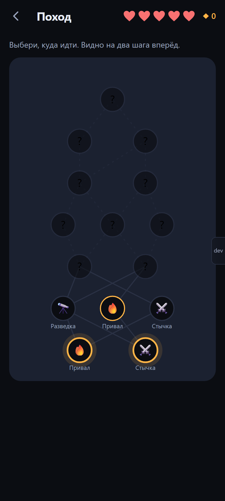
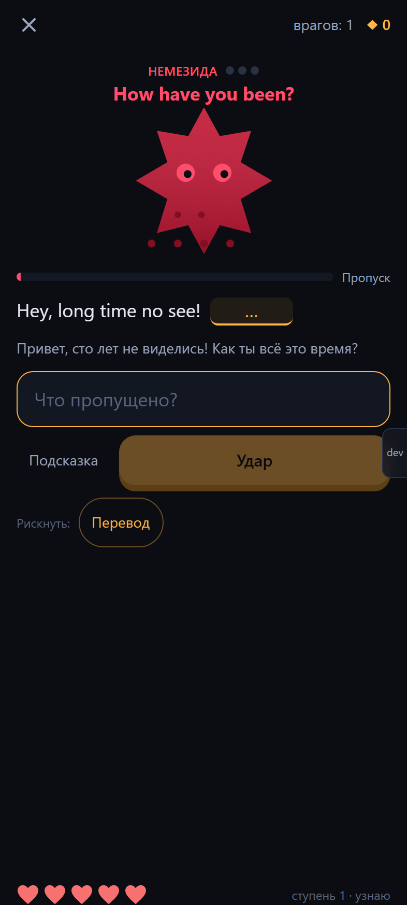
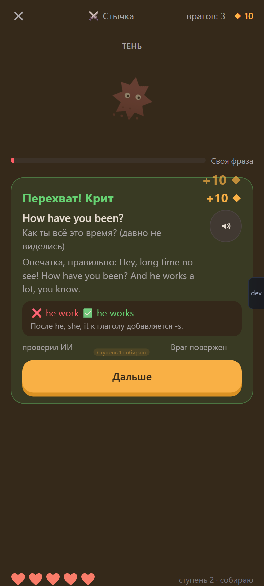
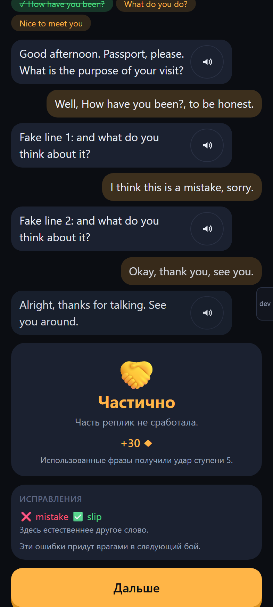

# Nemesis

**A roguelike that teaches spoken English. Every phrase is an enemy, and every attack is an answer in English.**

Play it: **https://learning-game-five.vercel.app** (works in a phone browser, installable as an app, fully offline after the first visit).

<p>
  
  
  
  
</p>

Flashcard apps train you to *recognize* a phrase. A conversation needs you to *recall* it in a second. Nemesis is built around the second skill: there is no "I know this" button, only answers.

> The interface is in Russian: it is a personal project for a Russian-speaking B2 learner. The code, comments and this README are in English.

## How it plays

- **Runs.** A run is a map of six steps and a final boss. You pick your path through ambushes, skirmishes, scouting (new phrases), rests and dialogue scenes. Each battle node is a set of phrases due today.
- **Battles.** Every hit is an English answer. A wind-up bar fills while you think; answer before it fills for a critical hit.
- **Debtors.** Miss a phrase and it retreats into the fog, then comes back 3 to 5 answers later in a different task and needs two hits in a row.
- **Nemeses.** Fail a phrase three times and it becomes a nemesis: it has a name, scars and a count of its wins over you. It hunts you in its own lair and dies only after you beat it on three different days. Then it goes to the Hall of Trophies.
- **The Echo.** The final boss of a run is made of every phrase you missed in it, each striking with the hardest move available.
- **Progression.** Runes buy permanent upgrades in camp (more hearts, a fourth boon choice, a boon at the start, streak freezes, looks and themes). Levels, lands, a day streak and celebrations keep the loop going.

### Moves (stages of knowing a phrase)

| Stage | Meaning | Moves |
|---|---|---|
| 0 | new | Introduction |
| 1 | recognize | Swipe (does the meaning match?), Listening |
| 2 | assemble | Build the sentence from tiles, Fill the gap |
| 3 | recall | Translate a situation, Dictation |
| 4 | speak | Voice (microphone), Own phrase (answer a question about your life) |
| 5 | use | Improv: a new situation, 6 seconds to start speaking |

A **trap** move (spot and fix the mistake) trains grammar patterns the learner keeps getting wrong: articles, "can" for habits, adverb order, subject–verb agreement, calques.

### Three rules of the game

1. Every action in battle is an answer in English.
2. Game effects never change the memory grade. Boons change runes, hearts and pacing, not how the scheduler rates your answer.
3. A lost run never takes away what you learned.

## How it teaches

- **Spaced repetition with FSRS** ([ts-fsrs](https://github.com/open-spaced-repetition/ts-fsrs)) decides what comes back and when. Debts first, then nemeses, then reviews, then new phrases, with a load regulator that stops new phrases when you are behind.
- **Retrieval over recognition.** A phrase climbs from swiping to speaking. Each return uses a different move, so you meet it from several angles instead of memorizing one card.
- **Phrases, not words.** The seed has 303 phrases in 9 lands (small talk, opinions, daily life, emotions, stories and plans, work and dev, travel, phrasal verbs, fillers), each with contexts, situations, false meanings and a usage note.
- **Your own life as content.** Paste any English text into the reader, tap a word or drag across up to eight, and the phrase goes into your next scouting node with the sentence it came from.

## The AI layer (optional, free)

The game works completely without AI and without a network. AI is an amplifier:

- **Checks free answers** in Own phrase and Improv, and explains each mistake in one Russian sentence (❌ what you said, ✅ what to say).
- **Runs dialogue scenes**: negotiate rent with a landlord, explain your trip at passport control, deliver bad news on a work call. The character replies in role, and the scene ends in success, partial success or failure.
- **Turns mistakes into enemies.** A grammar slip wakes up its pattern and sends a Chameleon (a trap enemy) into the next battle; other slips become new phrases with the correct version.
- **Builds phrases from your life**: write what you could not say in Russian and get the natural English; paste a text and pick 5 to 10 useful phrases; get a translation in context in the reader.
- **Keeps contexts fresh**: once a day it writes new example sentences and situations for tomorrow's reviews, and a mnemonic for every nemesis.

### Connecting it

1. Get a free API key in [Google AI Studio](https://aistudio.google.com/api-keys) (Gemini). A [Groq](https://console.groq.com/keys) key can be added as a backup.
2. In the app open **Настройки → ИИ** (Settings → AI), paste the key and press **Проверить** (Check).
3. The default model is `gemini-3.8-flash`; change it in the same screen if Google renames its free models.

Keys are stored only in IndexedDB on your device. They are never sent anywhere except the provider's API, never put in the repository or the bundle, and never included in the JSON export. Requests contain only the learning phrases and your answers in scenes. The client keeps to the free tier: one request at a time, at least 5 seconds apart, at most 100 a day, with backoff on rate limits and a cache for everything generated.

## Tech stack

- Vite + React 19 + TypeScript (strict), Tailwind CSS 4
- Zustand for state, Dexie (IndexedDB) for storage
- ts-fsrs for scheduling, motion and canvas-confetti for animation
- vite-plugin-pwa (offline, installable), react-router
- Web Speech API for text-to-speech and recognition, Web Audio for synthesized sound effects
- Vitest for the engine, Playwright for end-to-end tests, oxlint
- Gemini and Groq through plain `fetch`, no SDKs

No backend. The first screen is about 170 KB gzipped; battles, scenes, the reader and the seed load lazily.

## Getting started

Requires Node.js 22.

```bash
npm install
npm run dev          # dev server on http://localhost:5173
```

| Command | What it does |
|---|---|
| `npm run dev` | Dev server with the dev panel (time shift, runes, reset, force a nemesis) |
| `npm run typecheck` | `tsc -b --noEmit` |
| `npm run lint` | oxlint |
| `npm test` | Vitest unit tests for the engine and game logic |
| `npm run build` | Production build into `dist/` |
| `npm run preview` | Serve `dist/` on port 4173 (needed to test the PWA and offline mode) |
| `npm run e2e` | Playwright scenarios on a phone (393×873, touch), a small phone (360×800) and desktop (1280×800) |
| `npm run check` | Typecheck, lint, unit tests and build |

End-to-end tests run against `vite build --mode e2e`: a production build that keeps the dev panel and a `window.__nemesis` test hook (store state, the expected answer of the current task, fake speech, a rule-based stand-in for the AI). A regular `npm run build` contains none of it.

To record the demo video:

```bash
npx playwright test --config playwright.demo.config.ts
```

## Project structure

```
src/engine/    pure learning logic, no React: scheduler, FSRS progress, debts, nemeses, answer checking, streak, lands, stats
src/game/      game logic: runs, map, combat, boons, upgrades, encounters, balance.ts (every balance number)
src/moves/     one folder per move, lazily loaded
src/ai/        providers (Gemini, Groq), request queue, cache, prompts and validators, daily job, test double
src/reading/   tokenizing, selection rules and phrase matching for the reader
src/speech/    text-to-speech and speech recognition wrappers
src/db/        Dexie schema, repositories, backup
src/content/   seed phrases (9 lands), grammar patterns, dialogue scenes
src/screens/   one file per screen
src/store/     Zustand stores (the run, the camp, the profile, the clock)
src/ui/        shared components, sprites, sounds, celebrations
e2e/           Playwright scenarios (regression for every stage)
docs/          verification reports and screenshots for each build stage
```

`engine/` knows nothing about `game/`. The game calls the engine and never overrides its grades.

## Deployment

The app is a static site. It is deployed on Vercel straight from GitHub; `vercel.json` rewrites every path to `index.html` so deep links work. For GitHub Pages, build with `BASE_PATH=/learning-game/`: the base path flows into the router, the manifest and the service worker.

## How it was built

The full specification lives in [SPEC.md](SPEC.md) (in Russian). The app was built with [Claude Code](https://claude.com/claude-code) in stages: scaffold, a single battle, runs, sound and speech, nemeses and progression, the reading mode, the AI layer, polish and deployment. Every stage ended with a self-check in a real browser at phone size, screenshots reviewed by eye and a report in [docs/verification](docs/verification).

## License

No license has been chosen yet. This is a personal project.
